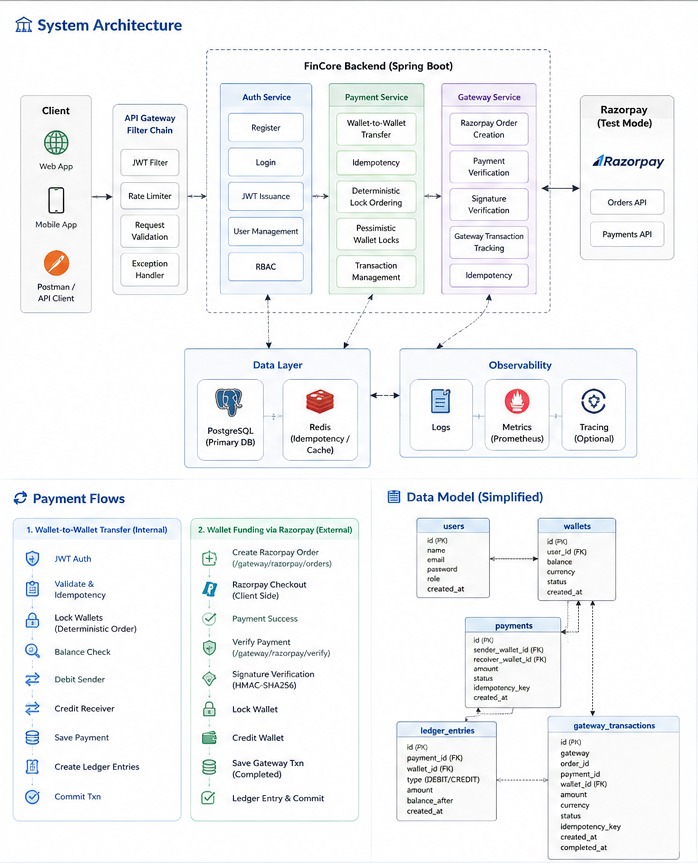
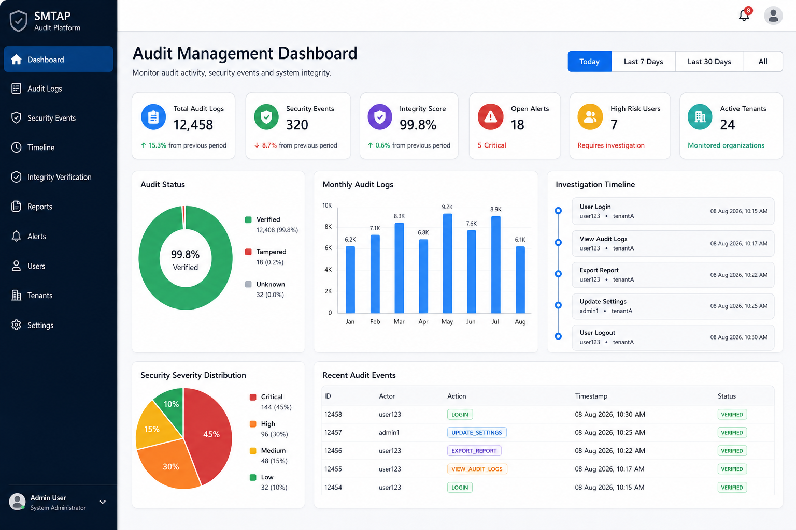
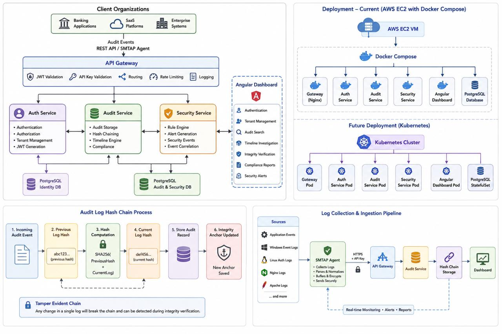
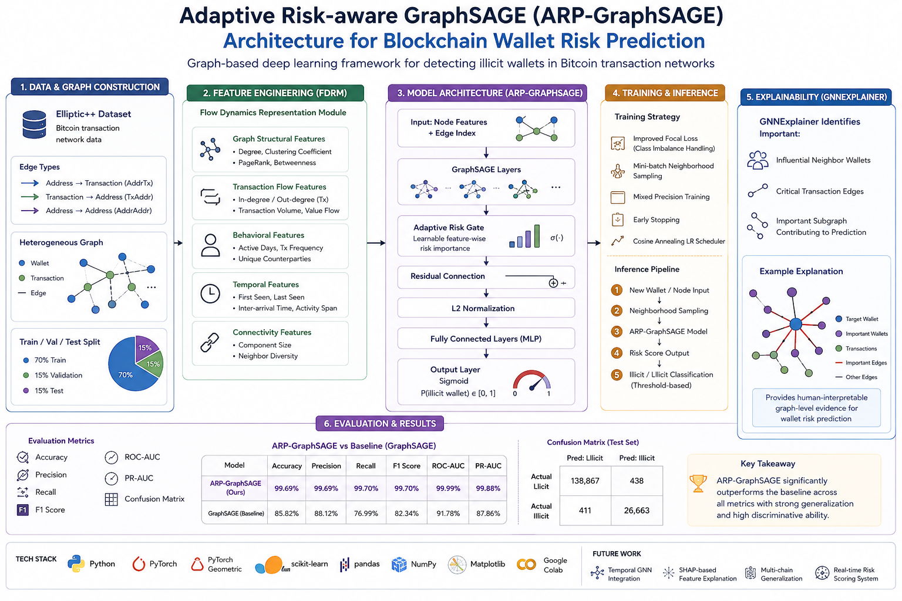
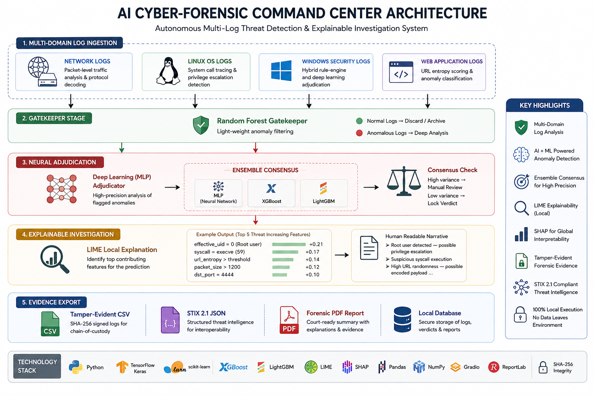
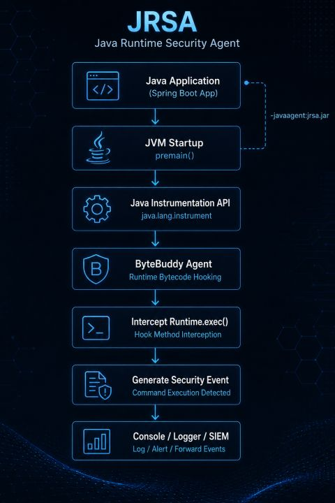

# 👋 Ravi Sankar Manem

**Backend & Security Engineer | Applied ML Research**

I build secure backend and security-focused systems, with hands-on work spanning **transaction processing, audit infrastructure, runtime security, and security analytics**.

My engineering work focuses on **correctness, consistency, observability, and threat detection**, while my research interests include **graph-based machine learning and intelligent security systems**.

Currently exploring **distributed systems, JVM instrumentation, graph neural networks, and AI security**.
---

## 🔬 Featured Engineering & Research Projects

### 1. 💳 FinCore — Secure Payment Processing Platform

**Java 21 · Spring Boot 4 · Spring Security · PostgreSQL · Redis · JPA · Razorpay · Grafana k6**

A secure payment-processing backend designed around **transaction correctness, idempotency, concurrency control, auditability, and external payment-gateway integration**.

- Designed a modular Spring Boot backend separating **authentication, wallet management, payment processing, ledger management, and gateway integration**.
- Implemented **JWT authentication and role-based access control** with request validation and rate limiting.
- Implemented **idempotent payment processing** to prevent duplicate transactions during retries and repeated client requests.
- Used **pessimistic wallet locking with deterministic lock ordering** to maintain balance consistency under concurrent transfers and reduce deadlock risk.
- Implemented transactional **atomic debit/credit operations with rollback on failure**.
- Built a **double-entry-style ledger** for payment traceability and balance-change auditing.
- Integrated **Razorpay Test Mode** for external wallet funding through server-side order creation and payment verification.
- Implemented **Razorpay signature verification using HMAC-SHA256** before accepting externally initiated payments.
- Added persistent **gateway transaction tracking** for Razorpay order IDs, payment IDs, idempotency keys, wallet associations, amounts, currencies, statuses, and completion timestamps.
- Added gateway-level **idempotency handling** so repeated order requests with the same idempotency key return the existing gateway transaction instead of creating another order.
- Load-tested internal wallet-to-wallet payment processing with **up to 1,000 virtual users**, validating concurrency, transaction consistency, and failure handling.
- Load-tested Razorpay order creation using **Grafana k6**, successfully completing **999 order-creation requests at 2 requests/second with 0% HTTP failures** and **256.87 ms P95 latency**.
- Tested gateway behavior under higher request rates and observed **Razorpay API rate limiting (HTTP 429)**, confirming that external gateway limits become a bottleneck before the local application layer.
- Designed the system so **internal wallet transfers and external gateway funding remain separate payment flows**, while sharing common transaction, idempotency, and persistence infrastructure.

**Repository:** [fincore-payment-platform](https://github.com/ravimnm/fincore-payment-platform)

  

---

### 2. 🛡️ Secure Multi-Tenant Audit Platform — SMTAP

**Java · Spring Boot · Angular · PostgreSQL · JWT · Docker · Microservices**

A security-focused audit and compliance platform designed for **multi-tenant environments requiring tamper-evident audit trails and runtime security visibility**.

- Designed a multi-service architecture covering **authentication, audit management, and security monitoring**.
- Built tamper-evident audit storage using **SHA-256 hash chaining** under a defined database/log-tampering threat model.
- Achieved approximately **15–20 ms average audit-write latency** in testing.
- Implemented integrity verification that detected **100% of simulated database-level audit-log tampering**.
- Enforced tenant-aware authorization using JWT-derived identity and tenant context.
- Built an investigation timeline to correlate audit and security events for incident analysis.
- Added runtime security telemetry and alert generation for sensitive application operations.
- Designed an ingestion path for application, Windows, Linux, Nginx, and Apache logs through the SMTAP Agent.
- Documented deployment architecture using Docker Compose with Kubernetes as a future deployment target.

**Repository:** [secure-multi-tenant-audit-platform](https://github.com/ravimnm/secure-multi-tenant-audit-platform)

  

  

---

### 3. 🧠 Adaptive Risk-aware GraphSAGE — Blockchain Wallet Risk Prediction

**Python · PyTorch · PyTorch Geometric · GraphSAGE · GNNExplainer · scikit-learn**

Research-oriented graph learning system for **risk prediction over blockchain transaction networks**.

- Constructed a heterogeneous graph representing **wallets, transactions, and transaction relationships**.
- Designed a **Flow Dynamics Representation Module (FDRM)** combining structural, transaction-flow, behavioral, temporal, and connectivity features.
- Used neighborhood sampling and class-imbalance-aware training strategies for graph learning.
- Compared the proposed architecture against a GraphSAGE baseline using accuracy, precision, recall, F1, ROC-AUC, and PR-AUC.
- Developed an adaptive risk-aware GraphSAGE architecture for illicit-wallet classification, incorporating graph structural, transaction-flow, behavioral, temporal, and connectivity features with neighborhood aggregation and explainability.
- Evaluated the model against a GraphSAGE baseline using precision, recall, F1, ROC-AUC, and PR-AUC, with earlier experiments achieving 90%+ F1 under the evaluated split.
- Applied **GNNExplainer** to identify influential neighbor wallets, transaction edges, and subgraphs contributing to wallet-risk predictions.
- Framed explainability as part of the model evaluation rather than treating it as a separate visualization layer.

**Repository:** [blockchain-wallet-risk-prediction](https://github.com/ravimnm/blockchain-wallet-risk-prediction)

  

---

### 4. 🔍 AI-Based Log Investigation Platform

**Python · Scikit-learn · Random Forest · Isolation Forest · SHAP · LIME**

Research-oriented **multi-source security-log analytics pipeline**, with end-to-end work on the **Windows Security Log ML pipeline**.

- Worked end-to-end on the Windows pipeline, from **log ingestion and preprocessing to feature engineering, model training, risk scoring, and investigation outputs**.
- Processed Windows security telemetry alongside other security-log sources for anomaly and threat analysis.
- Engineered behavioral features for identifying unusual activity patterns, including event frequency, rarity, burst activity, privilege-related behavior, and temporal activity.
- Used **Isolation Forest** for unsupervised anomaly detection and **Random Forest** for supervised risk classification.
- Built a risk-scoring workflow to prioritize suspicious security events for investigation.
- Applied **SHAP/LIME-based explainability** to identify features contributing to model decisions.
- Designed the workflow around SOC investigation concepts including anomaly triage, behavioral analysis, explainability, and evidence generation.
- Explored ensemble-based adjudication and human-readable investigation narratives for higher-confidence analysis.

**Repository:** [ai_based_log_investigation](https://github.com/ravimnm/ai_based_log_investigation)

  

---

### 5. ⚙️ Java Runtime Security Agent — JRSA

**Java · JVM Instrumentation API · ByteBuddy · Bytecode Manipulation**

A JVM-level runtime security agent for **observing and detecting security-sensitive application behavior without modifying application source code**.

- Built a Java agent using the **JVM Instrumentation API and ByteBuddy**.
- Intercepted sensitive runtime operations such as `Runtime.exec()` through bytecode instrumentation.
- Designed runtime hooks to capture execution context and generate structured security events.
- Explored agent lifecycle, class loading, bytecode transformation, and JVM instrumentation internals.
- Implemented policy-oriented runtime monitoring with **detect, simulate, and block** execution modes.
- Designed the telemetry path for forwarding runtime security events to downstream audit and investigation systems.
- Validated the agent by instrumenting a running Java application and observing command-execution events at runtime.

**Repository:** [java_runtime_security_agent](https://github.com/ravimnm/java_runtime_security_agent)

  

---

## 🧪 Research & Engineering Focus

I am particularly interested in problems where **systems engineering and security research overlap**:

- Security telemetry and behavioral detection
- Windows and multi-source security-log analysis
- Explainable machine learning for security investigations
- Graph neural networks for threat/risk prediction
- JVM internals and runtime instrumentation
- Tamper-evident audit infrastructure
- Secure distributed backend systems
- Digital forensics and incident response
- AI runtime security and intelligent security systems

---

## 🛠️ Technical Skills

### Backend & Systems
**Java · Spring Boot · Spring Security · REST APIs · JPA/Hibernate · Microservices · JVM Internals · JVM Instrumentation · ByteBuddy**

### Databases & Infrastructure
**PostgreSQL · MongoDB · Redis · Docker · Linux · AWS · Maven**

### Security & Observability
**JWT · RBAC · Audit Logging · Runtime Monitoring · Threat Detection · ELK Stack · MITRE ATT&CK · Security Telemetry**

### Machine Learning & Research
**Python · Scikit-learn · PyTorch · PyTorch Geometric · GraphSAGE · Random Forest · Isolation Forest · SHAP · LIME · GNNExplainer · Feature Engineering**

### Computer Science
**Data Structures & Algorithms · OOP · DBMS · Operating Systems · Computer Networks · Concurrency · Distributed Systems Fundamentals**

---

## 📚 Currently Exploring

- Advanced JVM internals and bytecode instrumentation
- Distributed systems and consistency models
- Security analytics and digital forensics
- Graph-based security analytics
- AI runtime security
- Explainable AI for security systems
- Scalable backend architecture

---

## 💻 Problem Solving

I regularly practice algorithmic problem solving, with a focus on **data structures, algorithmic patterns, and implementation correctness**.

**LeetCode:** 214 problems solved  
**Acceptance:** 76.15%  
**Easy:** 67 · **Medium:** 132 · **Hard:** 15

**Core areas:** Arrays · Hash Tables · Binary Search · Trees · Dynamic Programming · Backtracking · Two Pointers · Strings

[View my LeetCode profile](https://leetcode.com/u/ravimnm28/)

---

## 📊 GitHub

  
  

---

## 🌐 Connect

- **GitHub:** [github.com/ravimnm](https://github.com/ravimnm)
- **LinkedIn:** [linkedin.com/in/ravi-sankar-manem](https://linkedin.com/in/ravi-sankar-manem)
- **LeetCode:** [leetcode.com/u/ravimnm28](https://leetcode.com/u/ravimnm28/)
- **Email:** `manemravisankar28@gmail.com`

---

> **Engineering principle:** I focus on building systems where **security, correctness, auditability, and observability are part of the architecture — not afterthoughts.**
